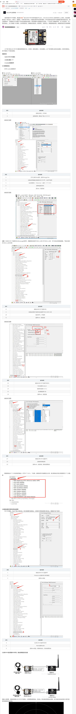

# UBLOX ZED-F9P搭建Ntrip Caster，组建RTK

 ## 配置UBLOX ZED-F9P基站

需要配置：

| 序号 | 操作                                                         |
| ---- | ------------------------------------------------------------ |
| 1    | 选择对应串口，打开串口                                       |
| 2    | 选择波特率115200，出厂默认38400                              |
| ３   | 打开工具栏View选项，选择 Message View                        |
| 4    | 在弹出的界面最左侧选择UBX-CFG-PRT，点击PRT选项               |
| 5    | 在右侧弹框中，选择uart1(usb连接选择usb)，Protocol out　选择5-rtcm3或者ubx+nmea+rtcm3 |
| 6    | 波特率选择115200                                             |
| 7    | 点击左下角send                                               |
| ８   | 继续在UBX-CFG下选择 MSG                                      |
| 9    | 在弹出的界面下拉框中依次选择RTCM3.3  ,1005,1074,1077,1084,1087,1094,1097,1124,1127,1230x5, 1450, |
| 10   | 勾选UART1，usb选项                                           |
| 11   | 选择Send，发送完成                                           |
| 12   | 继续在UBX-CFG下选择TMODE3                                    |
| 13   | Mode选择Survey-in                                            |
| 14   | 观测时间选择２００ｓ                                         |
| 15   | 定位精度选择３米(官方推荐是60s, 5米)                         |
| 16   | 选择Send，发送完成                                           |
| 17   | 查看基准站RTCM信息是否输出：打开RTCM3，下拉框，如果选项中灰度都显示亮正常，表示基准站已经正常获取到RTCM数据 |
| 18   | 继续在UBX-CFG下选择CFG                                       |
| 19   | 选择保存参数选项                                             |
| 20   | 选择send，发送完成，基准站配置成功                           |

新：
    RTCM3.3 1005
    RTCM3.3 1074
    RTCM3.3 1084
    RTCM3.3 1094
    RTCM3.3 1124
    RTCM3.3 1230 x 5 (Enable message every 5 seconds)


若切成移动站，如下操作

| 序号 | 操作说明                                   |
| ---- | ------------------------------------------ |
| 1    | 继续在UBX-CFG下选择PRT                     |
| 2    | Protocol out 选择UBX+NMEA模式              |
| 3    | 选择Send发送                               |
| 4    | 在UBX-CFG下选择TMODE3                      |
| 5    | Mode 选择Disable                           |
| 6    | 选择Send发送，参数保存成功，流动站配置完成 |

[参考配置ublox zed-f9p](https://blog.csdn.net/m0_48012049/article/details/107882430)

[参考配置ublox zed-f9p](https://learn.sparkfun.com/tutorials/getting-started-with-u-center-for-u-blox)




## 云端配置NtripCaster

### 使用Ntripcasterv2.0版本

- #### 安装在/opt/ntripcaster2 目录下

```bash
git clone git@github.com:vzhr/ntripcaster2.git
cd ntripcaster2
sudo chmod +x configure
./configure --prefix=/opt/ntripcaster2
make -j16
sudo make install
```

- #### 建立定时清理logs服务，自己配置settings.conf

```
cd units/
sudo cp ntripcaster2_archive.timer ntripcaster2_archive.service /etc/systemd/system
sudo cp archive_and_clean.sh settings.conf /opt/ntripcaster2/
sudo systemctrl enable ntripcaster2_archive.timer
sudo systemctrl start ntripcaster2_archive.timer
```

- #### 配置ntripcaster

  参考conf2文件夹下的配置，配置完copy到/opt/ntripcaster2/conf/ 文件夹下

  1. ntripcaster.conf

     主要参数解释

     - **encoder_password: ** ntripserver1.0版本推送基站gps数据需要的密码，ntripserver2版本需要用户名和密码，单独在groups.aut、users.aut 和sourcemounts.aut设置。

     - **admin_password，oper_password: ** telnet到云端ntripcaster用，输入一下命令

       telnet NtripCasterIP 2101
       ADMIN [admin_password]

       help

       有些操作需要oper权限

       oper oper_password

     - **server_name: ** The server_name specifies the name of the server and must not be set to an IP-address. It is very important that server_name resolves to the IP-address  the server is running on.大概意思应该是给个能解析到本ip的网址

     - **port: **端口，可以多个，换行写port 2101 port 80

     如果在云服务器中运行，记得开放对应端口，端口映射正确

  2. users.aut

     **创建用户文件**

     - 用户名:密码

  3.  groups.aut

      **用户分组文件**

      - 主要用于权限控制
      - 设置基站推送组guploader，客户端访问组，管理员组

  4.  clientmounts.aut

      **客户端挂载点权限配置**

      -  <MOUNTPOINT>:<GROUP1>,<GROUP2>,...,<GROUPn>
      - all:<group1>, <group2>...<groupn>，可访问全部挂载点的用户组
      - /admin ，必须有，网页端配置管理员组
      - /oper，必须有，网页端配置管理员组，权限更高

  5.  sourcemounts.aut

      **上传基站权限配置**

      - all:<groups1>...<groups2>，可以往全部挂载点上传的组
      - <MOUNTPOINT>:<GROUP1>,<GROUP2>,...,<GROUPn>

  6.  sourcetable.dat

      **挂载点信息组**

      - 客户端可以看到的挂载信息
      - 基本的是CAS，NET（可有可无）
      - STR来描述你的挂载点，如果没写，客户端查询不到但可以手动指定使用
      - 重要的是第二个字段，为你的挂载点名称
      - 具体看 NtripSourcetable.doc
      - CAS;139.196.97.222;2101;junioncaster2;junion;0;CHN;31.1348803;120.4311312;80.4;;
        NET;GREF;junion;B;N;;none;zhanghairong001@outlook.com;none 
        STR;UBXJUNION;junion_suzhou;RTCM 3.3;1005(1),1074(1),1077(1),1084(1),1087(1),1124(1),1127(1),1230(1),4072.1(1);2;GPS+GLO+BDS;SZ;CHN;31.1348803;120.4311312;0;0;GNSSNet V1.0;none;B;N;560;SINGLE


 - #### 启动ntripcaster

   ```bash
   cd /opt/ntripcaster2/bin
   sudo ./ntripcaster start
   ```

   你可以使用网页端查看一下，http://ip:2101/admin，用户名和密码使用你在clientmounts.aut文件中配置的/admin和/oper对应的组内成员和密码

   

## 推流

# **注意：RTKLIB master分支是旧的，tcp连接有bug，切换到最新分支！！** 

## 安装RTKLIB

```bash
git clone git@github.com:tomojitakasu/RTKLIB.git
cd RTKLIB
git tag
#找到最新的tag
git checkout v2.4.3-b34
sudo apt update
sudo apt install gfortran
cd lib
make
cd ../app/consapp
make -j16
sudo make install

```

## 云端 

```bash
#挂载点为UBXJUNION，按实际配置更改
#密码server001，按实际配置更改
# linux
str2str -in tcpsvr://:8899 -out ntrips://:server001@127.0.0.1:2101/UBXJUNION

```

云服务器打开对应端口号8899，以及端口映射正确

## 设备端基站推流

```bash
# 设备端口ttyACM0，按实际更改，有可能为ttyUSB0，在/dev/tty*查看
str2str -in serial://ttyACM0:115200:8:n:1 -out tcpcli://[ip]:8899
```


## 移动站拉流

```bash
# 如果是Windows，可以使用u-centor

# linux
# 从服务器拉到本地tcp服务上
#用户名和密码是在clientmounts.aut中定义的组有访问权限的成员
str2str -in ntrip://用户名:密码@139.196.97.222:2101/UBXJUNION -out tcpsvr://:7777 
git clone git@github.com:HKUST-Aerial-Robotics/ublox_driver.git
配置之后启动，发布ros消息

# 或者直接发送到移动站，再从另外的端口读出来
str2str -in ntrip://用户名:密码@139.196.97.222:2101/UBXJUNION -out serial://ttyACM1:115200:8:n:1
读取串口解析数据

```

